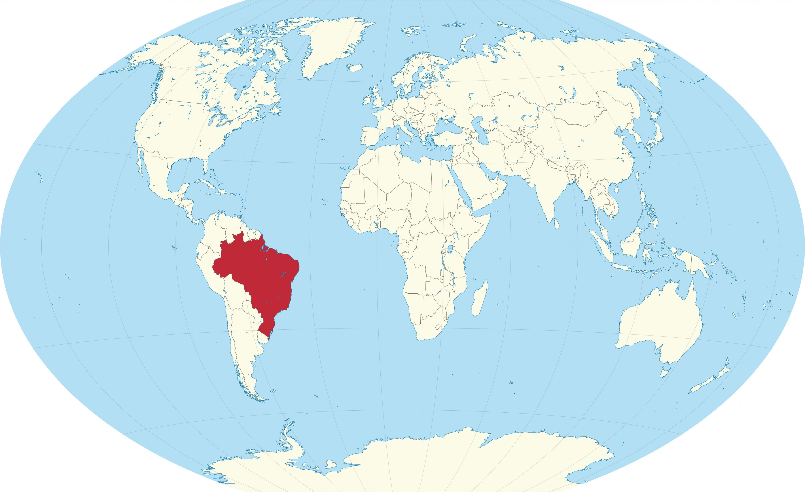
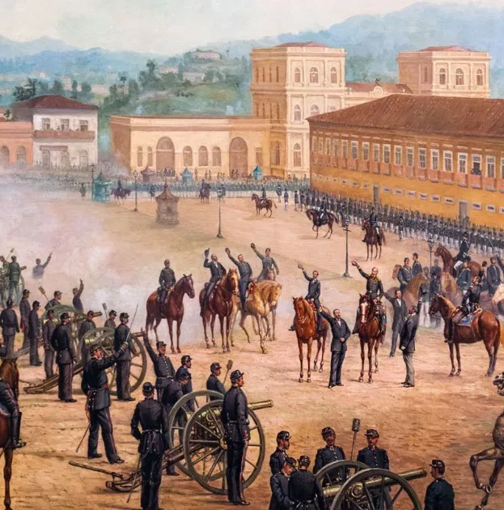
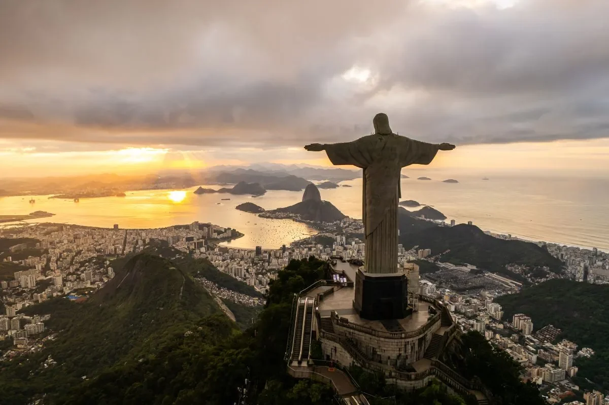
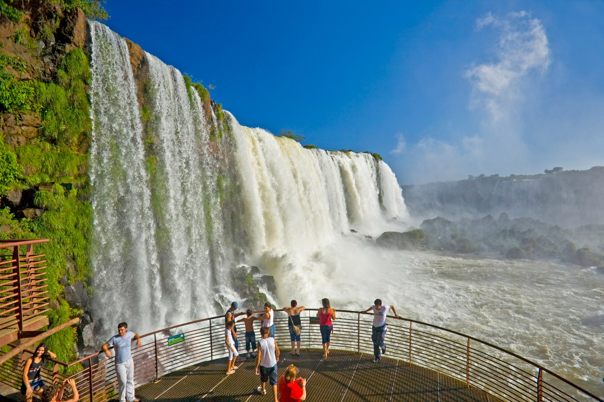
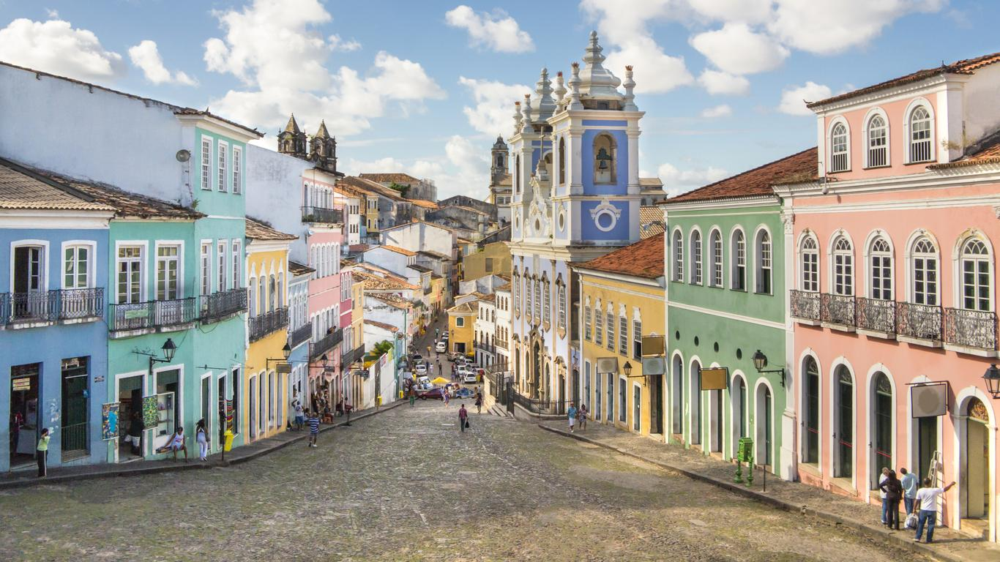
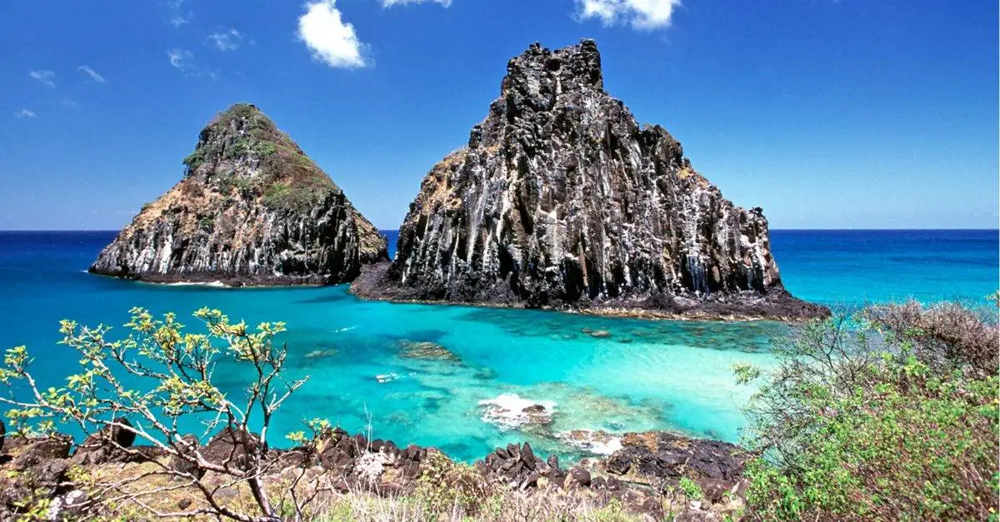

### Participantes do Grupo ###
> Nome: Guilherme Tófoli da Silva  
> Unicesumar de Londrina  
> Análise e Desenvolvimento de Sistemas - 3° Semestre 

# <h1 style="color:#00FF7F">Conhecendo o Brasil: Cultura, História e Pontos Turísticos</h1>

O **Brasil** é um país de dimensões continentais, localizado na América do Sul. Com uma imensa diversidade cultural, geográfica e histórica, é um destino turístico que encanta e surpreende. Desde as praias deslumbrantes até a vasta Amazônia, o Brasil oferece experiências únicas para todos os gostos.

### <h1 style="color:#00FF7F"> **Localização e Geografia do Brasil** </h1>
O Brasil ocupa a maior parte da América do Sul e possui uma vasta costa atlântica, com mais de 7.000 quilômetros de litoral. Além disso, o país faz fronteira com quase todos os países sul-americanos, exceto Chile e Equador.

A **capital** do Brasil é **Brasília**, uma cidade planejada e moderna. Já as maiores e mais conhecidas cidades incluem **São Paulo**, **Rio de Janeiro**, **Salvador** e **Belo Horizonte**.

### <h1 style="color:#00FF7F"> **História do Brasil** </h1>
A história do Brasil remonta ao **descobrimento** pelos portugueses em 1500, quando Pedro Álvares Cabral chegou ao litoral brasileiro. A colonização portuguesa durou mais de 300 anos, até a **independência** em 1822, proclamada por Dom Pedro I.

Ao longo do século XIX, o Brasil foi um **império** até se tornar uma **república** em 1889. O país também viveu momentos marcantes, como a **abolição da escravatura** em 1888 e a **Ditadura Militar** de 1964 a 1985, um período de tensão política.

Hoje, o Brasil é uma **república democrática** e um dos maiores países do mundo em termos de população e território.

### <h1 style="color:#00FF7F"> **Pontos Turísticos do Brasil** </h1>

#### **Cristo Redentor – Rio de Janeiro**
O **Cristo Redentor** é um dos pontos turísticos mais icônicos do Brasil. Localizado no topo do **Corcovado**, oferece uma vista panorâmica deslumbrante da cidade do Rio de Janeiro, das praias de Copacabana e Ipanema e da Baía de Guanabara.

#### **Cataratas do Iguaçu – Paraná**
As **Cataratas do Iguaçu** são um dos maiores conjuntos de quedas d'água do mundo, localizadas na fronteira do Brasil com a Argentina. A imensa força das águas é um espetáculo natural impressionante, e o parque nacional ao redor oferece trilhas e passeios de barco para uma experiência inesquecível.

#### **Amazônia – Região Norte**
A **Amazônia** é a maior floresta tropical do planeta, com uma biodiversidade imensa. A região é ideal para quem busca ecoturismo, oferecendo passeios de barco, trilhas pela selva e experiências culturais com povos indígenas.

#### **Pantanal – Centro-Oeste**
O **Pantanal** é o maior pântano alagado do mundo e um dos melhores lugares para observar a vida selvagem no Brasil. Lá, é possível ver animais como jacarés, capivaras, araras e até mesmo onças-pintadas.

#### **Salvador – Bahia**
A capital da **Bahia**, **Salvador**, é uma das cidades mais vibrantes do Brasil. Com seu centro histórico, o Pelourinho, e sua rica herança afro-brasileira, Salvador é o epicentro de festas populares como o **Carnaval** e o **Festival de Iemanjá**.

#### **Fernando de Noronha – Pernambuco**
O arquipélago de **Fernando de Noronha** é um destino paradisíaco com águas cristalinas, rica vida marinha e paisagens de tirar o fôlego. É considerado um dos melhores lugares do mundo para o mergulho.

### **Cultura Brasileira**
A cultura do Brasil é uma mistura fascinante de influências indígenas, africanas, portuguesas e outras. O país é conhecido por suas festas animadas, como o **Carnaval**, além de suas danças e músicas, incluindo o **samba**, **bossa nova**, **forró** e **frevo**.

### **Gastronomia Brasileira**
A **gastronomia brasileira** é uma das mais diversificadas do mundo. Cada região do Brasil tem suas próprias especialidades culinárias. Alguns dos pratos mais típicos incluem a **feijoada**, o **pão de queijo**, a **moqueca** e o **churrasco**.

### **Conclusão**
O Brasil é um país com uma grande diversidade de paisagens e culturas, oferecendo aos turistas uma variedade de experiências que vão desde o ecoturismo na Amazônia até a alegria contagiante do Carnaval. Seja explorando suas praias, florestas ou cidades históricas, o Brasil é sempre um destino surpreendente.
